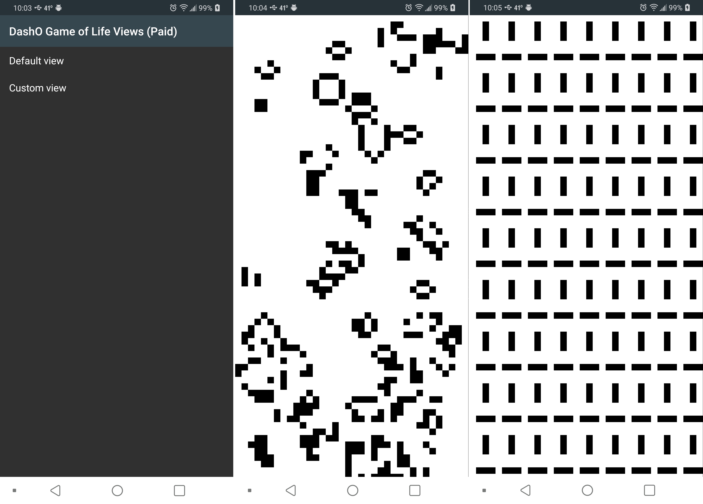

# DashO-GameOfLife

A sample Android app that demonstrates using [PreEmptive Protection - DashO](https://www.preemptive.com/products/dasho/overview) with the [DashO Gradle Plugin for Android](https://www.preemptive.com/dasho/pro/10.0/userguide/en/ref_dagp_index.html) on an application with libraries and product flavors.

This sample is a [Game of Life](https://en.wikipedia.org/wiki/Conway%27s_Game_of_Life) simulation application.
This project consists of the app itself and a library that it uses.

The application has two flavor dimensions: `view` and `monetization`.
The `view` dimension determines if the application launches a `menu` with a list of two views or just launches a `single` view.
The `monetization` dimension determines whether the application is interactive (`paid`) or non-interactive (`free`).
This interaction allows the user to give life to a cell by tapping.

These dimensions are ultimately [combined](https://developer.android.com/studio/build/build-variants.html#flavor-dimensions) to create four applications:

|             |                      `paid`                         |                         `free`                          |
|-------------|-----------------------------------------------------|---------------------------------------------------------|
|**`menu`**   | `menuPaid` - Shows a menu of two interactive views. | `menuFree` - Shows a menu of two non-interactive views. |
|**`single`** | `singlePaid` - Shows a single interactive view.     | `singleFree` - Shows a single non-interactive view.     |

The library is used by all four applications.
The `menu` flavors use the library's code directly and reference the library's `GameOfLifeView` class via XML.
The `single` flavors only use the library's code directly.

The instructions on the `master-vNext` branch demonstrate protecting the `release` builds with variant-specific configurations.

## Prerequisites

* [Java 8](http://www.oracle.com/technetwork/java/index.html)
* [PreEmptive Protection - DashO v10.0.0](https://www.preemptive.com/products/dasho/downloads) (or later)
* [Android Build Environment](https://developer.android.com/studio/index.html)
  * Platform v28

>**Note:** The Android-specific settings can be changed by editing the `build.gradle` files.

## Code Layout

This sample uses a standard layout for an Android project.

* `library` - The library project.
* `app` - The application project.
* `app/src/main` - The majority of the application source.
* `app/src/free` - Code which does not allow user interaction with the `GameOfLifeView`.
* `app/src/paid` - Code which allows user interaction with the `GameOfLifeView`.
* `app/src/menu` - The `AndroidManifest.xml` for all `menu` flavors.
* `app/src/single` - The `AndroidManifest.xml` for all `single` flavors.
* `app/src/menuFree` - Resources for the `menuFree` flavor.
* `app/src/menuPaid` - Resources for the `menuPaid` flavor.
* `app/src/singleFree` - Resources for the `singleFree` flavor.
* `app/src/singlePaid` - Resources for the `singlePaid` flavor.

## Setting up Protection

This branch already contains the DashO configuration.
When following the steps on the `master-vNext` branch, the following files were created and/or modified:

* `build.gradle` - The DashO Gradle Plugin for Android was added to the build script.
* `app/build.gradle` - Applied the `com.preemptive.dasho.android` plugin, enabled R8 with `minifyEnabled`, and enabled R8's optimization using `proguardFiles`.
* `app/free.dox` - Created to configure the protection of the `free` variants.
* `app/project.dox` -  Created to configure the protection of the `paid` variants.

>**Note:**
>The plugin should find DashO automatically if DashO is installed in the default location.
>If not, there are multiple ways to [configure DashO Home](https://www.preemptive.com/dasho/pro/10.0/userguide/en/ref_dagp_dasho_home.html).

## Running the Application

Because of the Emulator Check, the application will respond differently based on where it is run.

|             |                   Paid Variants                      |                                 Free Variants                                 |
|-------------|------------------------------------------------------|-------------------------------------------------------------------------------|
|**Device**   | Interactive views. Tapping a cell brings it to life. | Non-interactive views. Tapping tells user to "upgrade".                       |
|**Emulator** | Interactive views. Tapping a cell brings it to life. | Non-interactive views with blinker patterns. Tapping tells user to "upgrade". |

The first two screens are the starting pages for the `menu` and `single` variants.
The last screen shows what to expect when running a `free` variant on an emulator.

### Building

Run `gradlew clean assembleRelease` to compile and protect all the release variants.

### Installing

The four different variants can be simultaneously installed:

* `gradlew installMenuFreeRelease` - Installs _DashO MF Game Of Life_.
* `gradlew installMenuPaidRelease` - Installs _DashO MP Game Of Life_.
* `gradlew installSingleFreeRelease` - Installs _DashO SF Game Of Life_.
* `gradlew installSinglePaidRelease` - Installs _DashO SP Game Of Life_.

### Uninstalling

You can uninstall all the variants by running `gradlew uninstallAll`.

### Everything at Once

Run a custom task to just do all of it: `gradlew doAllTheThings`.

## Verifying Protection

You can validate the build is using the appropriate configurations and that it is protecting the application.

### Reviewing DashO's Protection

The output from the Gradle build will show when DashO is run.

### Verify the Flavor-specific Configuration

If you add `-DSHOW_DASHO_CMD` when building (e.g. `gradlew doAllTheThings -DSHOW_DASHO_CMD`), the information being passed to DashO will be printed to the console as the `transformClassesAndResourcesWithDashOFor...` tasks are run.
This will include a `Running:` line where you can see the full arguments used to run DashO including which `.dox` configuration file is passed.

### Verbose Output

If you want to see more information on what DashO is doing, you can add a `dasho` closure to `app/build.gradle` and [configure](https://www.preemptive.com/dasho/pro/10.0/userguide/en/ref_dagp_config.html#dasho) `verbose true`.
This will provide you with the verbose output from the protection process.

### Decompiling the APK

To further investigate you can use the following tools to look at the final protected APK:

* [Apktool](https://ibotpeaches.github.io/Apktool/)
* [dex2jar](https://github.com/pxb1988/dex2jar)
* [Bytecode Viewer](https://bytecodeviewer.com/)

## About DashO

_PreEmptive Protection - DashO_ is a [Java and Android obfuscator](https://www.preemptive.com/products/dasho/) and application hardening solution from [PreEmptive Solutions](https://www.preemptive.com/).
DashO's obfuscation, hardening, and runtime check features make your application much harder to reverse engineer, pirate, or steal data from.
World-class technical support for DashO is available through our [website](https://www.preemptive.com/support/dasho-support) and/or our [support request form](https://www.preemptive.com/contact/supportrequestform).

## Original Source

This sample is based on [GameOfLifeView](https://github.com/thiagokimo/GameOfLifeView) by [Thiago Rocha](http://kimo.io).

## License

    Copyright 2019 PreEmptive Solutions, LLC.

    Copyright 2011, 2012 Thiago Rocha

    Licensed under the Apache License, Version 2.0 (the "License");
    you may not use this file except in compliance with the License.
    You may obtain a copy of the License at

       <http://www.apache.org/licenses/LICENSE-2.0>

    Unless required by applicable law or agreed to in writing, software
    distributed under the License is distributed on an "AS IS" BASIS,
    WITHOUT WARRANTIES OR CONDITIONS OF ANY KIND, either express or implied.
    See the License for the specific language governing permissions and
    limitations under the License.
